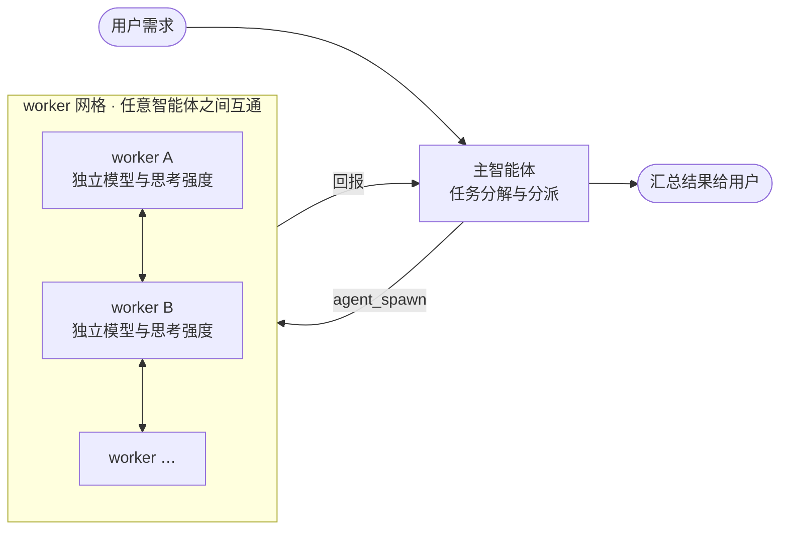
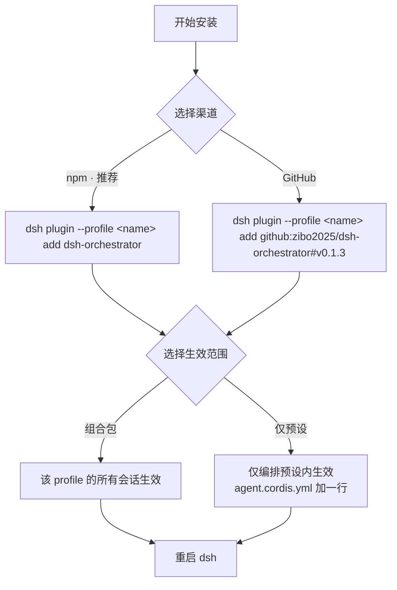

# dsh-orchestrator

> **orchestrator** 意为「编排器 / 协调者」；读音：美 /ˈɔːrkəstreɪtər/ · 英 /ˈɔːkɪstreɪtə(r)/，重音在第三音节，近似「奥克斯**特雷**特尔」。

面向 [DeepSeek Harness](https://github.com/deepseek-ai/deepseek-harness) 的原生全互联智能体编排插件：
一个主智能体负责任务分解与分派，多个 worker 负责实际执行，**任意智能体之间都能原生互发消息**
（主 → 子、子 → 主、子 ↔ 子），并支持为每个 worker 单独指定模型与思考强度。
没有文件信箱、没有提示词约定、没有轮询——消息直接走 harness 自带的智能体收件箱。



## 一键安装

把下面这句话发给你的 DSH 智能体，它会全自动完成安装：

> 请自动安装 dsh-orchestrator 插件：运行 `ls $DSH_HOME/profiles` 找到我的 profile 名，然后执行
> `dsh plugin --profile <该名字> add dsh-orchestrator`；若失败，加 `--registry=https://registry.npmjs.org`
> 重试一次；完成后提醒我重启 dsh。

装完**重启 `dsh`** 生效（运行中的进程不会热加载新安装的包）。

## 手动安装

| 方式 | 命令 |
| --- | --- |
| npm（推荐） | `dsh plugin --profile <name> add dsh-orchestrator` |
| GitHub 源码 | `dsh plugin --profile <name> add github:zibo2025/dsh-orchestrator#v0.1.3` |

- `<name>` 是你的 profile 名，即 `$DSH_HOME/profiles/` 下的目录名（例如 `web`）。
- 国内镜像未同步时用官方源：`dsh plugin --profile <name> add dsh-orchestrator --registry=https://registry.npmjs.org`。
- GitHub 方式需 pnpm ≥ 10 一次性 `allowBuilds` 授权：第一次 `add` 失败后，把它打印的包键加进
  profile 的 `pnpm-workspace.yaml` 的 `allowBuilds`，再重跑命令。



生效范围两种：**组合包**（该 profile 的所有会话都获得网格工具）或**仅预设**（在预设的
`agent.cordis.yml` 加一行 `- id: orchestrator` + `name: dsh-orchestrator`，并 `pnpm add dsh-orchestrator`，
推荐——协议只在你需要的地方生效）。

## 工具

| 工具 | 作用 |
| --- | --- |
| `agent_spawn` | 派生一个常驻后台、可持续对话的 worker，可单独指定 `provider` / `model` / `maxTokens` / `effort` |
| `agent_send` | 给网格内任意智能体发消息（子 → 主、子 ↔ 子都行），不返回对方的答复 |
| `agent_broadcast` | 一条消息发给网格内所有在线智能体 |
| `agent_list` | 查看网格花名册（含标签、父级、主智能体标记） |

`effort`（思考强度）取值：`off`（关闭）/ `high`（高）/ `max`（最高）。

开一个会话，直接提需求即可——网格协议会自动注入提示词，例如：

```
用 agent_spawn 创建两个 worker：
- 一个 label 为 researcher，effort 设为 high，调研「A 主题」并写结论；
- 一个 label 为 checker，用便宜的模型，独立复核 researcher 的结论；
让它们通过 agent_send 互发消息交换意见，最后把结论汇总给我。
```

## 注意

- **回合制**：消息成为目标智能体的*下一回合*，无法打断进行中的调用。
- **仅在线目标**：worker 完成后会离开注册表（`agent_send` 返回 `not online` 属正常），需要时重新派生。
- **网格 = 你的派生树**：其他会话的智能体对你的网格不可见。
- 装完工具没出现：重启 `dsh`（组合包方式）或在新会话选择该预设（仅预设方式）。

## 许可证

MIT
